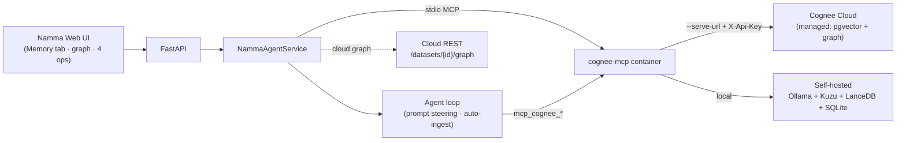

# Namma Agent × Cognee — "Where's My Context?"

> **WeMakeDevs × Cognee Hackathon submission.**
> Repo: https://github.com/SanthoshReddy352/Namma-Agent
> Tracks: **Best Use of Open Source** (self-hosted) **and** **Best Use of Cognee Cloud** — one codebase, both tracks.

## The hook

The Hangover problem: you wake up and the context is *gone*. Namma Agent used to
have the same problem — its memory was a single SQLite file with **keyword search
only**. Ask it "which database engine do I favour?" when you'd said "I prefer Kuzu"
and it drew a blank. The words didn't match, so the memory may as well not exist.

**Cognee fixes the hangover.** Namma now has a semantic + knowledge-graph memory: it
recalls by *meaning* and *relationships*, grows a living graph of your life and
projects, consolidates and forgets — and it does it from inside normal conversation,
not just a settings page.

## All four memory-lifecycle ops — visible and demoable

The grading rewards *depth of memory-lifecycle engagement*. Namma exercises the full
lifecycle, each with a place you can see it in the **Memory** tab:

| Op | In Namma | Where |
|---|---|---|
| **remember** | store a fact (fast session, or permanent build) | Memory → *Remember* |
| **recall** | semantic + graph question answering, even reworded | Memory → *Ask my memory* |
| **improve** (cognify) | *Consolidate* promotes session notes into the graph (entity extraction + linking) | Memory → *Improve memory* |
| **forget** | delete from graph + vector + relational stores | Memory → *Forget* |

Plus the **knowledge graph** itself — an Obsidian-style, force-directed render of
your memory — as the hero of the tab, on **both** backends.

## The money shot — keyword vs semantic

The Memory tab's **Keyword vs Semantic** panel runs the same query two ways: Namma's
original SQLite keyword search (FTS5/BM25) beside Cognee's semantic recall. Reword the
question with words you never stored and keyword search whiffs while Cognee still
answers. That before/after is the whole reason the integration exists.

## Memory in *real* conversation (not just a tab)

Cognee is woven into the agent loop, not bolted on:
- **Auto-ingestion** — normal chats are cognified into the graph in the background
  (opt-in `cognee.auto_ingest`), so the graph grows as you talk.
- **Prompt steering** — when Cognee is connected, the agent is instructed to call
  `mcp_cognee_recall` before answering anything about you, so it **visibly** uses
  Cognee mid-conversation.
- **Airtight recall** (opt-in `cognee.recall_context`) — for "what do you know about
  me?"-style questions, Namma proactively pulls the answer from Cognee so recall is
  guaranteed even across a brand-new chat session.
- **Learning Room** — finishing a module pushes its recap into the graph, so what you
  *study* becomes part of your memory too.

## Architecture — one codebase, two tracks



Namma talks to Cognee **only through MCP tools**, so it doesn't care where Cognee
runs. The single `cognee` server entry is the only thing that differs between tracks
— flipped with one click in **Settings → MCP → Cognee → Backend**. The Memory tab,
the four ops, the graph, and the agent loop are **identical** across both.

- **Track A — Best Use of Open Source:** self-hosted `cognee-mcp` container + Ollama
  embeddings + Kuzu/LanceDB/SQLite. Runs 100% on your machine; reproducible with one
  setup script. Graph renders from the container's `visualize_graph_ui`.
- **Track B — Best Use of Cognee Cloud:** same image in serve mode against managed
  Cognee Cloud (`--serve-url` + `X-Api-Key`). The cloud owns its DB + embeddings; the
  graph is synced from the cloud REST API (`/api/v1/datasets/{id}/graph`).

## Why it's safe (non-degradation)

Cognee is **opt-in and isolated**: it runs as a container via Namma's MCP client, so
**no Cognee dependency ever enters Namma's Python venv**. With the server off, Namma
behaves exactly as before (SQLite + FTS5 stays the source of truth). All Cognee
behaviour flags default off (or no-op when disconnected). Switching backends
force-removes the old container so there's never a lock-holding orphan.

## How to run it

Self-hosted (Track A):
```
scripts/setup_cognee.ps1        # or scripts/setup_cognee.sh — Docker + Ollama + image
python -m namma_agent --server  # open http://127.0.0.1:8000 → Settings → MCP → Cognee → Register
python scripts/seed_demo_memory.py   # optional: seed a rich demo graph
```
Cloud (Track B): Settings → MCP → Cognee → **Backend → Cognee Cloud**, paste your
instance URL + API key (platform.cognee.ai, dev code `COGNEE-35`), **Connect**.

Full setup + the hard-won troubleshooting table: [`docs/COGNEE.md`](docs/COGNEE.md).

## Rubric map

| Criterion | Where we earn it |
|---|---|
| **Best Use of Cognee** (depth) | all four ops in the UI + woven into the agent loop; graph on both backends; consolidate = cognify; recall across sessions |
| **Technical Excellence** | container isolation (zero new venv deps), persistence across restarts, reliable backend switching, 500+ offline tests |
| **Impact / UX** | the Memory tab + the keyword-vs-semantic money shot; "Namma remembers you" in a fresh chat |
| **Creativity** | the Obsidian-style live graph; the "Where's My Context?" framing |
| **Presentation** | this writeup + [`DEMO_SCRIPT.md`](DEMO_SCRIPT.md) + the demo video |

## Tests

`python -m pytest namma_agent/tests/ -q` → **506 passed** (fully offline/mocked; no
API key needed). Cognee-specific suites: `test_cognee_ops.py`, `test_cognee_cloud.py`,
`test_cognee_ingest.py`, `test_cognee_recall_context.py`.
