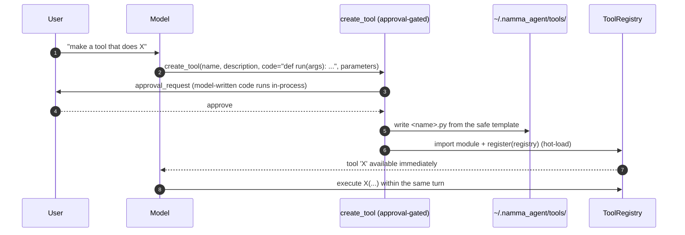

# Namma Agent — Modifying Its Own Code & Capabilities

Namma Agent can extend and reconfigure itself at runtime. It can **write a brand-new tool**
(Python it loads live), **author or refine skills** (procedures), **read its own
documentation**, and **change its own configuration** (provider, model, settings,
secrets). This document explains each mechanism, where the new artifacts land, and
the safety model around model-written code.

There are three layers of self-modification, cheapest/safest first:

| Layer | Tool | Adds | Needs code? | Gated? |
|------|------|------|-------------|--------|
| Procedure | `create_skill` / `update_skill` | a playbook over existing tools | no | no |
| Capability | `create_tool` | a new tool (new Python) | **yes** | **approval** |
| Configuration | `update_config` / `set_env_values` (Settings) | provider/model/keys/settings | no | UI / API |

> **Golden rule the model is told:** prefer a **skill** (no code) whenever the
> capability already exists; only write a **tool** when nothing covers the need.

---

## 1. Writing a new tool (`create_tool`)

When the user asks for a capability no existing tool provides ("make a tool that
converts USD to INR"), the model calls `create_tool` with a Python body.



What you provide:

| Field | Meaning |
|------|---------|
| `name` | short snake_case id (slugified) |
| `description` | what it does — **the model reads this to route to it later** |
| `code` | Python that defines **`def run(args): ...`** returning a `str`, `dict`, or `ToolResult` |
| `parameters` | optional JSON Schema for the tool's arguments |

The handler wraps your `run()` in a generated module (`namma_agent/tools/authoring.py:_TEMPLATE`):

```python
"""User-authored tool: usd_to_inr."""
from namma_agent.core.tools import ToolResult

NAME = "usd_to_inr"
DESCRIPTION = "Convert an amount in USD to INR."
PARAMETERS = {"type": "object", "properties": {"amount": {"type": "number"}}}


def run(args):
    return f"{args['amount']} USD ≈ {args['amount'] * 83:.2f} INR"


def register(registry):
    def _handler(args):
        out = run(args)
        if isinstance(out, ToolResult):
            return out
        if isinstance(out, dict):
            return ToolResult(ok=bool(out.get("ok", True)), content=str(out.get("content", out)), data=out)
        return ToolResult(ok=True, content=str(out))
    registry.register(NAME, DESCRIPTION, PARAMETERS, _handler)
```

- The file is written to **`~/.namma_agent/tools/<name>.py`** and **hot-loaded** into the
  live registry, so it's usable in the same turn.
- It's validated minimally: `name`, `description`, and `code` are required, and `code`
  must define `def run(`.
- A return that isn't a `ToolResult` is coerced (`str` → ok, `dict` → ok/content/data).

### Persistence across restarts

`~/.namma_agent/tools/` is imported on **every startup** by `load_user_tools()` (called from
`namma_agent/tools/__init__.py:load_tools`). So a tool the assistant wrote once is part of
its toolset forever — it survives restarts with no extra step. Files starting with `_`
are skipped; a tool that fails to import is logged and skipped (it can't break boot).

---

## 2. Authoring procedures (`create_skill` / `update_skill`)

For anything that orchestrates **existing** tools — a workflow, a checklist, a research
method — the model writes a **skill** instead of code. No Python, no approval, instantly
in the catalog. This is the preferred path. Full detail in [SKILLS.md](SKILLS.md#5-the-learning-loop--how-skills-get-created).

---

## 3. Reconfiguring itself (provider, model, settings, secrets)

Namma Agent can change its own configuration without editing files by hand:

- **`config.update_config(updates)`** writes a deep-merged overlay to
  `namma_agent/config.local.yaml`. The documented base `config.yaml` is **never** rewritten;
  the overlay wins at load time. This is how the Settings panel persists changes (e.g.
  switch `provider.type` from `anthropic` to `ollama`, change the model, toggle
  `auto_approve`).
- **`config.set_env_values(updates)`** creates/updates `KEY=value` lines in `.env`
  (preserving other lines) and applies them to the live environment — for API keys,
  Telegram tokens, etc.
- Both are exposed over **`GET`/`POST /api/settings`**, which the UI Settings panel uses.
- **`about_namma`** (`namma_agent/tools/selfdoc.py`) lets the assistant answer questions about
  *itself* — how to switch provider, what modes exist, how memory/skills/browser/Telegram
  work — by reading `namma_agent/self_knowledge.md` (with the configured assistant name
  substituted in).

Because provider selection is just config, the assistant can be told "use Claude Opus
from now on" and persist that to the overlay — no redeploy.

---

## 4. The safety model

Model-written tool code runs **in-process with the app's privileges**. The controls:

1. **Approval gate** — `create_tool` is `destructive=True`, so it triggers the per-turn
   approval round-trip (an `approval_request` the user must accept) before the code is
   written and loaded. The auto-approve setting can bypass this — only enable it in an
   environment you control.
2. **Prefer-skill guidance** — the system prompt and the `create_tool` description both
   steer the model to a no-code **skill** unless new code is truly required.
3. **Isolation of failure** — a user tool that throws on import is caught and skipped at
   load time; it cannot break startup or other tools.
4. **Audit trail** — every tool execution (including authored tools) is logged to the
   `audit` table with args + result.
5. **Explicit location** — authored artifacts live in a known, inspectable place:
   `~/.namma_agent/tools/` (code) and `~/.namma_agent/skills/` (procedures). You can read, edit, or
   delete them like any file.

> If you want the assistant to be unable to write code at all, remove the `authoring`
> tool module from discovery (or don't approve `create_tool`). Skills (no code) remain
> available.

---

## 5. See also

- How skills work and are authored → [SKILLS.md](SKILLS.md)
- Hand-writing tools and skills → [EXTENDING.md](EXTENDING.md)
- The tool system & approval gating → [ARCHITECTURE.md](ARCHITECTURE.md#7-tool-system)
