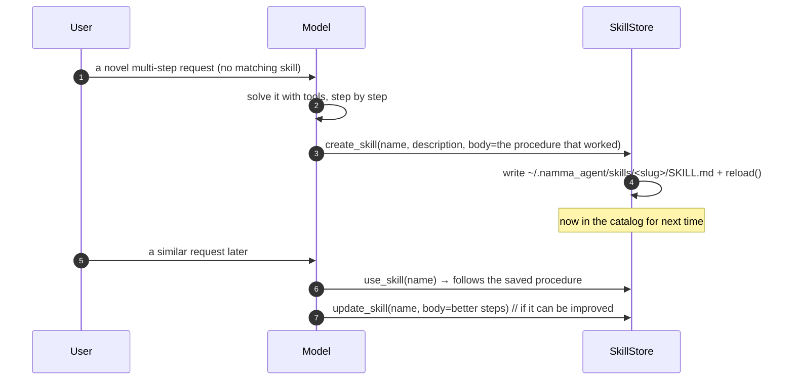

# Namma Agent — Skills (Procedural Memory)

A **skill** is a reusable playbook: a Markdown procedure the assistant can load and
follow when a request matches it. Skills are how Namma Agent remembers *how to do things*
(as opposed to *facts*, which live in memory). They are plain files — editable,
portable, and the assistant can author its own.

This document explains what skills are, the file format, how discovery and rendering
work, the tools that drive them, and the "learning loop" by which the assistant
creates and refines them. To write one yourself, see [EXTENDING.md](EXTENDING.md).

---

## 1. What a skill is

- A skill is a **folder** containing a `SKILL.md` file (Anthropic *Agent Skills*
  format, agentskills.io-compatible — ported from hermes-agent).
- `SKILL.md` has **YAML frontmatter** (name, description, platforms, category, tags)
  and a **markdown body** (the actual procedure).
- Skills live under two roots:
  - **Bundled** — `namma_agent/skills/` (ships with Namma Agent).
  - **Learned / user** — `~/.namma_agent/skills/` (where `create_skill` writes).
- On a name collision, **the learned skill wins**, so the assistant can override a
  bundled procedure with a better one it learned.

The four bundled seed skills:

| Skill | When it fires |
|------|----------------|
| `deep-research` | "research / look into / compare X" — sourced, synthesized answer |
| `one-three-one-rule` | "give me options / help me choose" — 1 problem, 3 options, 1 recommendation |
| `organize-files` | "organize / clean up / sort" a folder |
| `play-media` | "play X on YouTube / put on music / pause / skip" |

---

## 2. The `SKILL.md` format

```markdown
---
name: deep-research
description: >
  Research a topic in depth and produce a sourced, synthesized answer. Use when
  the user asks to "research", "look into", "compare", or wants a thorough,
  citation-backed overview rather than a quick fact.
platforms: [linux, macos, windows]
version: 1.0.0
category: research
metadata:
  hermes:
    tags: [research, web, synthesis]
---

# Deep Research

## When to Use
Trigger phrases, and when NOT to use this.

## Procedure
1. Clarify scope if ambiguous.
2. web_search for 3–5 angles; web_extract the best sources.
3. Cross-check claims; note disagreements.
4. Synthesize with citations.

## Verification
- Every claim has a source.
- Conflicting sources are acknowledged.
```

Frontmatter fields:

| Field | Meaning |
|------|---------|
| `name` | Unique id (kebab-case). Defaults to the folder name. |
| `description` | **The most important field** — the model reads this in the catalog to decide whether to load the skill. Make it trigger-phrase rich. |
| `platforms` | Optional list (`linux`/`macos`/`windows`); a skill is hidden on other platforms. Omit = all. |
| `category`, `version`, `metadata.hermes.tags` | Organizational metadata. |

The body has no required structure, but `When to Use` / `Procedure` / `Verification`
is the convention.

---

## 3. How skills work at runtime

```mermaid
flowchart TD
    boot[startup] --> reload[SkillStore.reload]
    reload --> scan[rglob SKILL.md across bundled + user roots<br/>parse frontmatter · filter by platform]
    scan --> cat["catalog_text(): one line per skill<br/>(name + short description)"]
    cat --> sys[injected into the system prompt as<br/>'AVAILABLE SKILLS']
    sys --> match{model sees a<br/>matching request}
    match -->|yes| call[model calls use_skill name]
    call --> render["render(): substitute SKILL_DIR / SESSION_ID<br/>+ optional inline-shell expansion"]
    render --> body[full procedure returned to the model]
    body --> follow[model follows the steps,<br/>calling real tools]
```

1. **Discovery** — at startup (and after any create/update) `SkillStore.reload()`
   walks both roots for `SKILL.md`, parses frontmatter, and keeps the ones for this
   platform. VCS/cache/venv dirs are skipped.
2. **Catalog injection** — only the **name + one-line description** of each skill goes
   into the system prompt. This keeps the always-present cost to one line per skill.
3. **Load on demand** — when a request matches, the model calls `use_skill(name)`,
   which returns the **full preprocessed body**. The model then follows that procedure,
   calling the real tools (`web_search`, `organize_dir`, `play_youtube`, …).
4. **Chat mode** — skills are disabled entirely in chat mode (pure conversation, no
   tools, no catalog).

### Preprocessing (template vars + inline shell)

`render()` expands two things in the body before returning it:

- **`${SKILL_DIR}`** → the skill's folder (for bundled helper files), **`${SESSION_ID}`**
  → the current session id.
- **Inline shell** — `` !`command` `` runs `command` and substitutes its output. This is
  **off by default** and only enabled when `skills.allow_inline_shell: true` (output is
  capped and time-limited). Use it for skills that need live context baked into the
  procedure.

---

## 4. The skill tools

The model drives skills through four tools (registered in `core/builtins.py`):

| Tool | What it does |
|------|--------------|
| `list_skills` | List available skills + descriptions (introspection). |
| `use_skill {name}` | Load and return the full procedure to follow. **Call this first** when a request matches a skill. |
| `create_skill {name, description, body, category?, tags?}` | Author a new skill into `~/.namma_agent/skills/`. |
| `update_skill {name, body?, description?}` | Refine an existing skill. |

---

## 5. The learning loop — how skills get created

Skills aren't only shipped; the assistant **writes its own**. The system prompt
instructs it to:

> After you solve a NOVEL multi-step task well (one with no matching skill), call
> `create_skill` to save the procedure so you're better next time; use `update_skill`
> to refine a skill that didn't go perfectly.



`create_skill` (via `SkillStore.create`):
1. Slugifies the name (`Deep Research` → `deep-research`).
2. Creates `~/.namma_agent/skills/<slug>/SKILL.md` with generated frontmatter (all
   platforms, version `1.0.0`, your category/tags) + your body.
3. Calls `reload()` so the skill is **immediately** in the catalog.

`update_skill` rewrites the body and/or description of an existing skill in place and
reloads. Because learned skills override bundled ones, the assistant can improve on a
shipped procedure.

> **Skills vs tools.** A *skill* is a procedure written in Markdown that orchestrates
> **existing** tools — no code, no approval needed. A *tool* is new Python that adds a
> **capability** that doesn't exist yet (see [SELF_MODIFICATION.md](SELF_MODIFICATION.md)).
> Prefer a skill whenever the capability is already there.

---

## 6. Configuration

```yaml
# namma_agent/config.yaml
skills:
  user_dir: ~/.namma_agent/skills      # where create_skill writes learned skills
  allow_inline_shell: false       # expand !`cmd` snippets inside SKILL.md (off by default)
```

---

## 7. See also

- Write a skill (or a tool) by hand → [EXTENDING.md](EXTENDING.md)
- Runtime self-authoring of tools → [SELF_MODIFICATION.md](SELF_MODIFICATION.md)
- Where skills sit in the system → [ARCHITECTURE.md](ARCHITECTURE.md#9-skills-procedural-memory)
